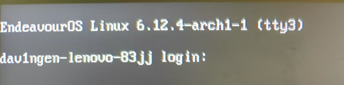

# 机器人学院GPU服务器使用指南(Robotics Academy GPU Server User Guide)

Author:Dav1nGen
Date:2024.12.13
Version:1.0

注意：使用前请确保了解linux的基础命令，并且具有自我诊断能力。

截至2024.12.13，机器人学院GPU服务器未连接外网，因此无法使用ssh远程连接使用服务器，因此本版本指南只适用于在服务器上直接使用GPU训练的情况。

---

## 目录

1. GPU服务器使用准则（参考）
   1. 系统安全
   2. 环境隔离
   3. 文件存放
2. GPU服务器使用流程
   1. 登陆服务器
   2. 使用GPU训练方案
   3. 服务器无网络训练解决方案

---

## 1. GPU服务器使用准则（参考）

### 1.1 系统安全

为了保证系统安全，需要遵循以下准则：

- 非必要不应使用root用户登陆，而应该使用普通用户登陆。

### 1.2 环境隔离

由于服务器上可能存在多个用户，同一个用户可能也会有不同的项目，因此建议每个用户创建自己的工作目录，并在该目录下创建自己的虚拟环境，以实现环境隔离。

环境隔离的两种方案(后文会具体讲解)：

1. 使用Anaconda创建虚拟环境
   - 优点：上手难度低，使用方便。
   - 缺点：需要安装Anaconda，占用磁盘空间较大。
2. 使用docker容器
   - 优点：轻量化，占用小。
   - 缺点：需要安装docker,创建容器时需要额外挂载GPU，需要熟练使用docker。

### 1.3 文件存放

不同的项目应该在用户目录（~/） 下创建不同的工作空间（例如： ~/workspace1、 ~/workspace2），以防止项目存放混乱。

## 2. GPU服务器使用流程

### 2.1 登陆服务器

由于学院服务器长期缺乏维护，因此目前只有root用户和和user2用户确定可以登陆：
| 用户名 | 密码 |
|:---:|:---:|
| root | nbut |
| user2 | 222222 |

登陆具体流程：

1. 服务器开机并插上显示器和键盘
2. 在显示器上看到登陆界面后（如图显示类似的“login”字样）,输入user2并按一下回车键，换行后输入对应的密码（密码输入过程中密码输入行无反应属于正常情况）并再次按一下回车键即可登陆
   

除此之外还有user、user3、user4这三个用户，密码不详不过无外乎nbut、NBUT、123456、333333（user3）、444444（user4）这几种密码，可以尝试登陆。

### 2.2 使用GPU训练方案

训练前先确保nvidia驱动正常安装，可以通过如下命令查看：

```bash
nvidia-smi
# 如果有如下类似的输出则可以继续后续步骤                                                                                                             [10:52:48]
Fri Dec 13 10:52:49 2024
+-----------------------------------------------------------------------------------------+
| NVIDIA-SMI 565.77                 Driver Version: 565.77         CUDA Version: 12.7     |
|-----------------------------------------+------------------------+----------------------+
| GPU  Name                 Persistence-M | Bus-Id          Disp.A | Volatile Uncorr. ECC |
| Fan  Temp   Perf          Pwr:Usage/Cap |           Memory-Usage | GPU-Util  Compute M. |
|                                         |                        |               MIG M. |
|=========================================+========================+======================|
|   0  NVIDIA GeForce RTX 4060 ...    Off |   00000000:01:00.0  On |                  N/A |
| N/A   35C    P8              6W /   55W |     750MiB /   8188MiB |      0%      Default |
|                                         |                        |                  N/A |
+-----------------------------------------+------------------------+----------------------+

+-----------------------------------------------------------------------------------------+
| Processes:                                                                              |
|  GPU   GI   CI        PID   Type   Process name                              GPU Memory |
|        ID   ID                                                               Usage      |
|=========================================================================================|
|    0   N/A  N/A       743      G   /usr/lib/Xorg                                  23MiB |
|    0   N/A  N/A      1113      G   Hyprland                                      327MiB |
|    0   N/A  N/A      1220      G   Xwayland                                        7MiB |
|    0   N/A  N/A      3106      G   ...yeDropper --variations-seed-version        109MiB |
|    0   N/A  N/A      3332      G   ...erProcess --variations-seed-version         73MiB |
|    0   N/A  N/A      5571      G   /usr/bin/kdeconnectd                            2MiB |
|    0   N/A  N/A      5577      G   /usr/lib/kactivitymanagerd                      2MiB |
|    0   N/A  N/A     16625      G   kitty                                          36MiB |
+-----------------------------------------------------------------------------------------+
```

目前有两种方案可以使用GPU训练：

1. 使用Anaconda创建虚拟环境
2. 使用docker容器

#### 2.2.1 使用Anaconda创建虚拟环境

1. 安装Anaconda
   - 安装Anaconda的详细步骤见[Anaconda安装教程](https://docs.anaconda.com/anaconda/install/)
2. 创建虚拟环境
   - 打开终端，输入如下命令创建虚拟环境：
   ```bash
   conda create -n envname python=3.7
   ```
   - 其中，envname是虚拟环境的名字，python=3.7表示创建的虚拟环境使用python3.7版本，可以根据需要修改。
3. 激活虚拟环境
   - 创建虚拟环境后，需要激活虚拟环境才能使用，激活虚拟环境的命令如下：
   ```bash
   conda activate envname
   ```
   - 其中，envname是虚拟环境的名字，可以根据需要修改。
4. 安装依赖
   - 激活虚拟环境后，就可以根基需要在该虚拟环境中安装自己所需的依赖了。

#### 2.2.2 使用docker容器（以pytorch镜像为例）

1. 安装docker
   - 安装docker的详细步骤见官网教程[Install Docker Engine](https://docs.docker.com/engine/install/)
2. 安装 NVIDIA Container Toolkit

   ```bash
   sudo apt-get install -y nvidia-container-toolkit
   sudo systemctl restart docker
   ```

3. 拉取docker镜像

   - 在终端中输入如下命令拉取docker镜像：

   ```bash
   docker pull [镜像名]
   # 以拉取流行的pytorch镜像为例
   docker pull pytorch/pytorch
   ```

   其他所需的镜像可以去[docker hub](https://hub.docker.com/)自行拉取

4. 创建docker容器
   ```bash
   docker run --gpus all -it  \ # 创建容器并挂载GPU
   -v [填写你的workspace绝对路径] \ # 挂载外部磁盘
   pytorch/pytorch bash # 容器名称
   ```
   在容器中挂载了外部磁盘可以访问到本地的代码或数据；在容器中挂载了GPU才能正常调用GPU进行训练。
   创建完容器正常退出容器后，可以通过以下命令重新进入
   ```bash
   # 先查看存在的容器
   docker ps -a
   # 重新进入容器
   docker exec -it [存在的容器名] bash
   ```

### 2.3 服务器无网络训练解决方案

由于目前服务器没有外网，因此无法直接从外网下载依赖，因此需要提前下载好anaconda或docker依赖并打包成压缩包，然后在服务器上解压并安装依赖，具体方案如下

#### 2.3.1 Anaconda

2.3之前的操作需要现在自己的带有nvidia显卡的设备上完成，**本节默认使用者在自己设备已经可以运行神经网络训练**。

1. 通过以下命令将自己设备上的满足自己需求的anaconda虚拟环境导出

```bash
    # 首先确保自己在虚拟环境中
    conda activate [环境名称]

    # 使用 conda-pack 打包整个环境
    # [环境名称].tar.gz 是生成的压缩包，包含了所有环境依赖
    conda install -n base conda-pack
    conda-pack -n [环境名称] -o [环境名称].tar.gz

```

2.  将压缩包传输到目标设备
    通过 U 盘或硬盘等物理介质将压缩包传输到学院服务器。1. 将带有虚拟环境压缩包的物理存储设备插入服务器USB-A口 2. 在终端中输入以下命令挂载设备

    ````bash # 首先进入以下目录查看你的物理存储硬件名
    cd /dev
    ls # 会显示如下很多设备名（常见外接存储设备名称：/dev/sdX、/dev/sda）
    dav1ngen@dav1ngen-lenovo-83jj: /dev
    $ ls [11:23:12]
    acpi_thermal_rel hidraw0 kvm null ppp tty1 tty28 tty46 tty7 ttyS24 userfaultfd vcsu3
    autofs hidraw1 log nvidia0 psaux tty10 tty29 tty47 tty8 ttyS25 userio vcsu4
    block hidraw2 loop-control nvidia-caps ptmx tty11 tty3 tty48 tty9 ttyS26 v4l vcsu5
    bsg hidraw3 mapper nvidiactl ptp0 tty12 tty30 tty49 ttyS0 ttyS27 vcs vcsu6
    btrfs-control hidraw4 media0 nvidia-modeset pts tty13 tty31 tty5 ttyS1 ttyS28 vcs1 vfio
    bus hidraw5 mei0 nvidia-uvm random tty14 tty32 tty50 ttyS10 ttyS29 vcs2 vga_arbiter
    char hidraw6 mem nvidia-uvm-tools rfkill tty15 tty33 tty51 ttyS11 ttyS3 vcs3 vhci
    console hpet mqueue nvme0 rtc tty16 tty34 tty52 ttyS12 ttyS30 vcs4 vhost-net
    core hugepages mtd nvme0n1 rtc0 tty17 tty35 tty53 ttyS13 ttyS31 vcs5 vhost-vsock
    cpu hwrng mtd0 nvme0n1p1 sda tty18 tty36 tty54 ttyS14 ttyS4 vcs6 video0
    cpu_dma_latency i2c-0 mtd0ro nvme0n1p2 shm tty19 tty37 tty55 ttyS15 ttyS5 vcsa video1
    cuse i2c-1 mtd1 nvme0n1p3 snapshot tty2 tty38 tty56 ttyS16 ttyS6 vcsa1 watchdog
    disk i2c-2 mtd1ro nvme0n1p4 snd tty20 tty39 tty57 ttyS17 ttyS7 vcsa2 watchdog0
    dma_heap i2c-3 mtd2 nvme0n1p5 stderr tty21 tty4 tty58 ttyS18 ttyS8 vcsa3 zero
    dri i2c-4 mtd2ro nvme1 stdin tty22 tty40 tty59 ttyS19 ttyS9 vcsa4
    fb0 i2c-5 mtd3 nvme1n1 stdout tty23 tty41 tty6 ttyS2 udmabuf vcsa5
    fd i2c-6 mtd3ro nvme1n1p1 tpm0 tty24 tty42 tty60 ttyS20 uhid vcsa6
    full i2c-7 net nvme1n1p2 tpmrm0 tty25 tty43 tty61 ttyS21 uinput vcsu
    fuse input ng0n1 nvram tty tty26 tty44 tty62 ttyS22 urandom vcsu1
    gpiochip0 kmsg ng1n1 port tty0 tty27 tty45 tty63 ttyS23 usb vcsu2 # 在此处以我的外接硬盘为例，名称为 sda # 确认设备名称后，将其挂载到指定目录即可访问硬盘文件
    sudo mount [你的外接设备名] /mnt/[你的外接设备名] # 之后你就可以在/mnt/[你的设备名]/ 这个目录下访问你存储设备的文件

        #将你存储设备中打包好的虚拟环境移动到服务器中
        cp [环境名称].tar.gz ~/[你的workspace]/
        #解压
        tar -xzf [环境名称].tar.gz -C ~/[你的workspace]
        #执行conda-unpack部署你的虚拟环境
        ./[你的虚拟环境目录路径]/bin/conda-unpack
        source /path/to/env/bin/activate
        # 尝试进入虚拟环境
        conda activate [环境名称]
        ```
    ````

#### 2.3.2 Docker

2.3之前的操作需要现在自己的带有nvidia显卡的设备上完成，如何使用docker部署神经网络网络训练详见本指南2.2.2，**本节默认使用者在自己设备已经可以运行神经网络训练**。

```bash
    # 首先查看自己docker容器的ID
    docker -ps -a
    #会出现如下类似信息
    CONTAINER ID   IMAGE                           COMMAND                  CREATED          STATUS          PORTS     NAMES
    1a2b3c4d5e6f   nvidia/cuda:11.0-base           "/bin/sh -c 'apt-get…"   2 minutes ago    Up 2 minutes              determined_wing
    # 使用 docker export 导出容器
    docker export -o [容器名称].tar [CONTAINER ID]
    # 将.tar后缀的压缩包通过物理存储介质传输到学院GPU服务器，详见2.3.1第2条

    # 在目标设备上部署容器
    # 使用 docker import 将导出的容器文件导入为镜像
    docker import - [容器名称]:latest
    # 导入后，使用该镜像启动容器
    docker run --gpus all -it  \  # 创建容器并挂载GPU
    -v [填写你的workspace绝对路径] \  # 挂载外部磁盘
    [容器名称]/latest bash # 容器名称

    # 创建完容器正常退出容器后，可以通过以下命令重新进入
    # 先查看存在的容器
    docker ps -a
    # 重新进入容器
    docker exec -it [存在的容器名] bash

```
